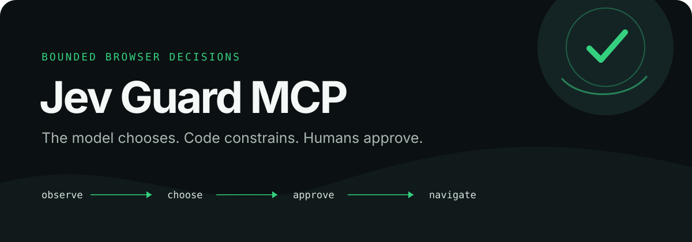
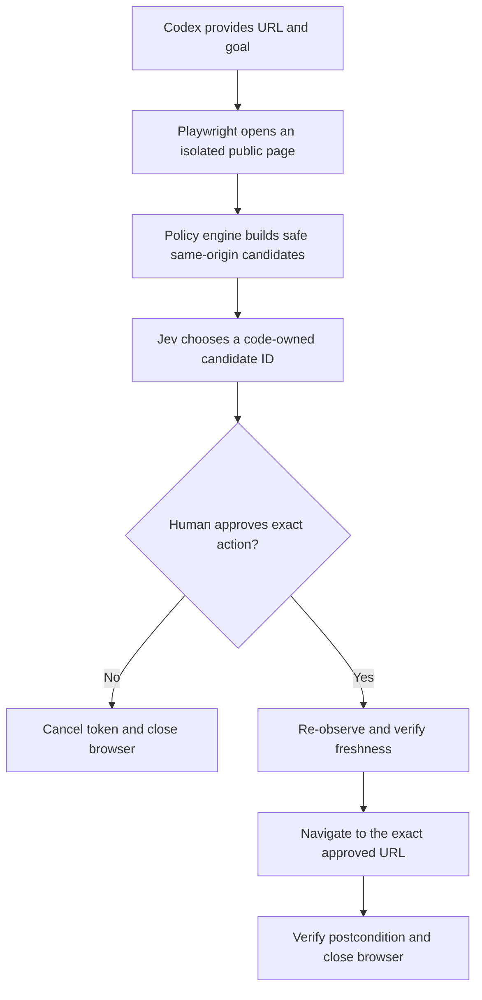

<p align="center">
  
</p>

<p align="center">
  <a href="https://github.com/raniellimontagna/jev-guard-mcp/actions/workflows/ci.yml"></a>
  
  <a href="LICENSE"></a>
  
</p>

Jev Guard MCP is an experimental, browser-only MCP server that lets Jev choose among code-owned navigation options without handing browser control to the model.

Codex provides intent. Playwright observes a fresh public browser context. The policy engine reduces the page to safe links. Jev selects one bounded ID. The trusted MCP client shows the proposed action and obtains human approval before calling execute.

> **Resumo em português:** o Jev Guard conecta Codex, Jev/TypeSafe e Playwright dentro de um limite explícito. O modelo escolhe somente links produzidos pelo código. O cliente MCP confiável deve mostrar origem, rótulo e destino e obter aprovação humana explícita antes de executar; o servidor não comprova essa aprovação.

## Why this exists

Computer-use agents are powerful precisely where mistakes are expensive: they can inherit sessions, interpret hostile pages and turn ambiguous model output into side effects. Jev Guard explores a narrower architecture:

- use Jev for fast semantic judgment;
- keep authority, URL policy and freshness checks in deterministic code;
- isolate the browser from the user's Chrome profile and environment secrets;
- make the proposed action inspectable before execution;
- refuse authentication, forms, downloads and transactional flows.

## How it works



The model never emits selectors, coordinates, JavaScript or arbitrary URLs. The executor accepts only a fresh, single-use preview token.

## Approval flow

A trusted MCP client is responsible for showing the source, label and destination and obtaining explicit human approval before calling `jev_guard_execute`. Possession of a preview token is the technical authorization to execute; the server cannot independently attest human approval. Keep tokens private to the trusted client. The workflow is preview → human approval → execute.

`jev_guard_preview` opens the source page and returns a proposal without navigating to the proposed destination:

```json
{
  "status": "ready",
  "sourceUrl": "https://en.wikipedia.org/wiki/Headless_browser",
  "confidence": 1,
  "action": {
    "id": "link_3",
    "label": "web browser",
    "destination": "https://en.wikipedia.org/wiki/Web_browser"
  },
  "usage": {
    "attempts": 1,
    "model": "jev-1.13.0"
  }
}
```

After human approval, `jev_guard_execute` consumes the token before attempting the exact navigation. `jev_guard_cancel` consumes it without navigating.

## Safety boundary

| Allowed | Intentionally unsupported |
|---|---|
| Public HTTPS pages | Authenticated accounts and private pages |
| Visible, same-origin links | Typing, forms, buttons and uploads |
| Query-free, low-risk GET navigation | Login, OAuth, purchase, deletion or confirmation |
| Fresh isolated Chrome contexts | Personal Chrome profiles, cookies or local storage |
| One approved navigation per token | Downloads, native apps and whole-computer control |

Additional controls include:

- JavaScript and WebSockets disabled in the page context;
- localhost, private networks and private DNS resolutions blocked;
- exact main-document URL enforced before network access and after navigation;
- every HTTPS request fetched with redirects disabled; all 3xx responses and subframe documents blocked;
- page text and goals redacted before TypeSafe calls;
- minimum effective confidence of `0.80`;
- tokens stored only in memory, single-use and valid for 120 seconds;
- capacity reserved before browser/model work, including consumed executions; shutdown closes active browsers;
- bounded public MCP error codes and messages, with no dependency call logs;
- TypeSafe model pinned to `jev-1.13.0`, with response validation and no automatic retries.

Read the full [architecture](docs/architecture.md) and [threat model](docs/threat-model.md), including the documented DNS-rebinding, adversarial-content and GET-side-effect risks.

## Quickstart

Requirements: Node.js 22+, Google Chrome and a TypeSafe API key.

```bash
git clone git@github.com/raniellimontagna/jev-guard-mcp.git
cd jev-guard-mcp
npm ci --ignore-scripts
npm test
npm run typecheck
npm run build
```

The server reads `TYPESAFE_API_KEY` from the process environment. On macOS, `scripts/run-from-keychain.sh` can load it from a Keychain item whose service is `typesafe-api-key`, without placing the value in Git or MCP configuration.

```bash
./scripts/run-from-keychain.sh
```

Candidate Codex configuration, after replacing the command with the absolute path of your clone:

```toml
[mcp_servers.jev_guard]
command = "/absolute/path/to/jev-guard-mcp/scripts/run-from-keychain.sh"
```

Registering the server is deliberately separate from cloning it. Review the security boundary first and restart Codex after changing MCP configuration.

## MCP tools

| Tool | Effect |
|---|---|
| `jev_guard_preview` | Opens a public source page and returns one bounded proposal plus a short-lived token. It does not navigate to the proposal. |
| `jev_guard_execute` | Consumes a fresh token and performs exactly one approved navigation. |
| `jev_guard_cancel` | Consumes a pending token and closes its isolated browser without navigating. |

## Verification

The repository test suite covers URL policy, DNS/private-network rejection, redaction, candidate extraction, Jev response validation, token lifecycle, stale-page rejection, shutdown and MCP schemas.

A public smoke test is available:

```bash
npm run smoke:live
npm run smoke:live -- --execute
```

The executing form performs one bounded Wikipedia navigation and incurs a TypeSafe call. It never prints the credential or preview token.

Verified public route on 2026-09-20:

```text
Headless browser → web browser → Web browser
https://en.wikipedia.org/wiki/Headless_browser
https://en.wikipedia.org/wiki/Web_browser
```

## Development

```bash
npm test
npm run typecheck
npm run build
npm audit --omit=dev
npm audit signatures
npm pack --dry-run
```

Contributions should preserve the code-owned action boundary. Expanding into authenticated pages, typing, forms or transactional actions requires a separate threat model and explicit confirmation design.

## Status and license

Jev Guard MCP is experimental research software. It is not a general-purpose browser agent and should not be used for authenticated, private or high-consequence workflows.

Released under the [MIT License](LICENSE).
