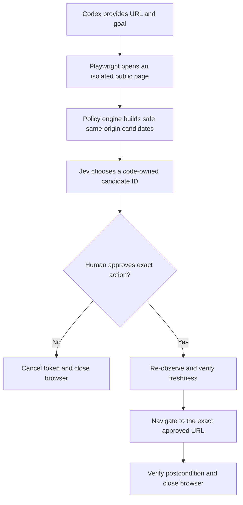

# Public Repository Showcase Implementation Plan

> **For agentic workers:** REQUIRED SUB-SKILL: Use superpowers:subagent-driven-development (recommended) or superpowers:executing-plans to implement this plan task-by-task. Steps use checkbox (`- [ ]`) syntax for tracking.

**Goal:** Publish Jev Guard MCP as a polished, evidence-backed public repository on Ranielli Montagna's personal GitHub profile.

**Architecture:** Keep the executable pilot unchanged while adding a repository-owned SVG, an English-first bilingual README, a pinned GitHub Actions workflow and an MIT license. Promote the verified commit to `main`, publish it explicitly through the `raniellimontagna` GitHub account, then verify metadata, rendering and CI from the public boundary.

**Tech Stack:** Markdown, SVG, Mermaid, Node.js 22, TypeScript, Node test runner, GitHub Actions, GitHub CLI

## Global Constraints

- GitHub owner is exactly `raniellimontagna`; do not publish through `raniellimontagna-lemon`.
- Repository is public, named `jev-guard-mcp`, with default branch `main`.
- README is English-first with a compact Portuguese summary.
- License is MIT; package remains private/experimental `0.1.0` and is not published to npm.
- No release or version tag is created.
- No force-push, secret upload, Codex global MCP registration or blog publication is in scope.
- Badges must represent real repository state; no fake usage, performance or security claims.
- CI never receives `TYPESAFE_API_KEY` and never invokes `npm run smoke:live`.
- The existing threat model and residual-risk language remain linked and visible.
- The article remains gated on later Codex-native testing and measured evidence.

---

### Task 1: Build the visual README contract

**Files:**
- Create: `docs/assets/jev-guard-banner.svg`
- Modify: `README.md`
- Modify: `test/documentation.test.ts`

**Interfaces:**
- Consumes: existing MCP tool names, security boundary and verified Wikipedia smoke route.
- Produces: stable README section anchors, a local banner path and factual public-facing copy used by GitHub rendering.

- [ ] **Step 1: Replace the README documentation test with the public-showcase contract**

Replace the first test in `test/documentation.test.ts` with:

```ts
test("README presents the public project without overstating its authority", async () => {
  const readme = await contents("../README.md");
  assert.match(readme, /docs\/assets\/jev-guard-banner\.svg/);
  assert.match(readme, /raniellimontagna\/jev-guard-mcp\/actions\/workflows\/ci\.yml/);
  assert.match(readme, /browser-only/i);
  assert.match(readme, /Resumo em português/i);
  assert.match(readme, /```mermaid/);
  assert.match(readme, /jev_guard_preview/);
  assert.match(readme, /jev_guard_execute/);
  assert.match(readme, /jev_guard_cancel/);
  assert.match(readme, /scripts\/run-from-keychain\.sh/);
  assert.match(readme, /TYPESAFE_API_KEY/);
  assert.match(readme, /human approval/i);
  assert.match(readme, /experimental/i);
  assert.doesNotMatch(readme, /não foi publicado|not published/i);
});

test("repository-owned banner is accessible and self-contained", async () => {
  const banner = await contents("../docs/assets/jev-guard-banner.svg");
  assert.match(banner, /<svg[^>]+role="img"/);
  assert.match(banner, /<title>Jev Guard MCP<\/title>/);
  assert.match(banner, /observe.*choose.*approve.*navigate/is);
  assert.doesNotMatch(banner, /https?:\/\//i);
  assert.doesNotMatch(banner, /<script/i);
});
```

- [ ] **Step 2: Run the documentation test and verify it fails**

Run:

```bash
npm test -- test/documentation.test.ts
```

Expected: FAIL because `docs/assets/jev-guard-banner.svg`, the public badge URL, Mermaid flow and bilingual copy do not exist yet.

- [ ] **Step 3: Create the self-contained SVG banner**

Create `docs/assets/jev-guard-banner.svg` with:

```svg
<svg xmlns="http://www.w3.org/2000/svg" role="img" aria-labelledby="title desc" viewBox="0 0 1200 420">
  <title id="title">Jev Guard MCP</title>
  <desc id="desc">A guarded browser decision flow: observe, choose, approve, navigate.</desc>
  <rect width="1200" height="420" rx="28" fill="#0b1012"/>
  <path d="M0 318 C220 260 350 390 570 320 S950 230 1200 290 V420 H0Z" fill="#101a1b"/>
  <circle cx="1050" cy="82" r="118" fill="#142425"/>
  <circle cx="1050" cy="82" r="68" fill="none" stroke="#35d07f" stroke-width="2" opacity=".35"/>
  <g fill="none" stroke="#35d07f" stroke-linecap="round" stroke-linejoin="round">
    <path d="M1022 84 l20 20 42-48" stroke-width="10"/>
    <path d="M975 137 C1006 172 1087 174 1121 133" stroke-width="3" opacity=".55"/>
  </g>
  <text x="72" y="105" fill="#35d07f" font-family="ui-monospace, SFMono-Regular, Menlo, monospace" font-size="18" letter-spacing="3">BOUNDED BROWSER DECISIONS</text>
  <text x="68" y="196" fill="#f4f8f6" font-family="Inter, ui-sans-serif, system-ui, sans-serif" font-size="76" font-weight="750" letter-spacing="-3">Jev Guard MCP</text>
  <text x="72" y="248" fill="#a9b8b3" font-family="Inter, ui-sans-serif, system-ui, sans-serif" font-size="25">The model chooses. Code constrains. Humans approve.</text>
  <g font-family="ui-monospace, SFMono-Regular, Menlo, monospace" font-size="17">
    <g fill="#d9e4e0">
      <text x="72" y="344">observe</text>
      <text x="290" y="344">choose</text>
      <text x="508" y="344">approve</text>
      <text x="744" y="344">navigate</text>
    </g>
    <g stroke="#35d07f" stroke-width="2" fill="none" opacity=".75">
      <path d="M157 338 H263"/>
      <path d="M375 338 H481"/>
      <path d="M603 338 H717"/>
    </g>
    <g fill="#35d07f">
      <path d="M263 338 l-9-6 v12Z"/>
      <path d="M481 338 l-9-6 v12Z"/>
      <path d="M717 338 l-9-6 v12Z"/>
    </g>
  </g>
</svg>
```

- [ ] **Step 4: Replace `README.md` with the public showcase copy**

Use this exact structure and copy:

````markdown
<p align="center">
  
</p>

<p align="center">
  <a href="https://github.com/raniellimontagna/jev-guard-mcp/actions/workflows/ci.yml"></a>
  
  <a href="LICENSE"></a>
  
</p>

Jev Guard MCP is an experimental, browser-only MCP server that lets Jev choose among code-owned navigation options without handing browser control to the model.

Codex provides intent. Playwright observes a fresh public browser context. The policy engine reduces the page to safe links. Jev selects one bounded ID. A human approves the exact destination before a single navigation can execute.

> **Resumo em português:** o Jev Guard conecta Codex, Jev/TypeSafe e Playwright dentro de um limite explícito. O modelo escolhe somente links produzidos pelo código, e nenhuma navegação acontece sem aprovação humana da origem, do rótulo e do destino.

## Why this exists

Computer-use agents are powerful precisely where mistakes are expensive: they can inherit sessions, interpret hostile pages and turn ambiguous model output into side effects. Jev Guard explores a narrower architecture:

- use Jev for fast semantic judgment;
- keep authority, URL policy and freshness checks in deterministic code;
- isolate the browser from the user's Chrome profile and environment secrets;
- make the proposed action inspectable before execution;
- refuse authentication, forms, downloads and transactional flows.

## How it works



The model never emits selectors, coordinates, JavaScript or arbitrary URLs. The executor accepts only a fresh, single-use preview token.

## Approval flow

`jev_guard_preview` returns a proposal without navigating:

```json
{
  "status": "ready",
  "sourceUrl": "https://en.wikipedia.org/wiki/Headless_browser",
  "confidence": 1,
  "action": {
    "id": "link_3",
    "label": "web browser",
    "destination": "https://en.wikipedia.org/wiki/Web_browser"
  },
  "usage": {
    "attempts": 1,
    "model": "jev-1.13.0"
  }
}
```

After human approval, `jev_guard_execute` consumes the token before attempting the exact navigation. `jev_guard_cancel` consumes it without navigating.

## Safety boundary

| Allowed | Intentionally unsupported |
|---|---|
| Public HTTPS pages | Authenticated accounts and private pages |
| Visible, same-origin links | Typing, forms, buttons and uploads |
| Query-free, low-risk GET navigation | Login, OAuth, purchase, deletion or confirmation |
| Fresh isolated Chrome contexts | Personal Chrome profiles, cookies or local storage |
| One approved navigation per token | Downloads, native apps and whole-computer control |

Additional controls include:

- JavaScript and WebSockets disabled in the page context;
- localhost, private networks and private DNS resolutions blocked;
- exact main-document URL enforced before network access and after navigation;
- page text and goals redacted before TypeSafe calls;
- minimum effective confidence of `0.80`;
- tokens stored only in memory, single-use and valid for 120 seconds;
- TypeSafe model pinned to `jev-1.13.0`, with response validation and no automatic retries.

Read the full [architecture](docs/architecture.md) and [threat model](docs/threat-model.md), including the documented DNS-rebinding, adversarial-content and GET-side-effect risks.

## Quickstart

Requirements: Node.js 22+, Google Chrome and a TypeSafe API key.

```bash
git clone git@github.com:raniellimontagna/jev-guard-mcp.git
cd jev-guard-mcp
npm ci --ignore-scripts
npm test
npm run typecheck
npm run build
```

The server reads `TYPESAFE_API_KEY` from the process environment. On macOS, `scripts/run-from-keychain.sh` can load it from a Keychain item whose service is `typesafe-api-key`, without placing the value in Git or MCP configuration.

```bash
./scripts/run-from-keychain.sh
```

Candidate Codex configuration, after replacing the command with the absolute path of your clone:

```toml
[mcp_servers.jev_guard]
command = "/absolute/path/to/jev-guard-mcp/scripts/run-from-keychain.sh"
```

Registering the server is deliberately separate from cloning it. Review the security boundary first and restart Codex after changing MCP configuration.

## MCP tools

| Tool | Effect |
|---|---|
| `jev_guard_preview` | Observes a public page and returns one bounded proposal plus a short-lived token. It does not navigate. |
| `jev_guard_execute` | Consumes a fresh token and performs exactly one approved navigation. |
| `jev_guard_cancel` | Consumes a pending token and closes its isolated browser without navigating. |

## Verification

The repository test suite covers URL policy, DNS/private-network rejection, redaction, candidate extraction, Jev response validation, token lifecycle, stale-page rejection, shutdown and MCP schemas.

A public smoke test is available:

```bash
npm run smoke:live
npm run smoke:live -- --execute
```

The executing form performs one bounded Wikipedia navigation and incurs a TypeSafe call. It never prints the credential or preview token.

Verified public route on 2026-09-20:

```text
Headless browser → web browser → Web browser
https://en.wikipedia.org/wiki/Headless_browser
https://en.wikipedia.org/wiki/Web_browser
```

## Development

```bash
npm test
npm run typecheck
npm run build
npm audit --omit=dev
npm audit signatures
npm pack --dry-run
```

Contributions should preserve the code-owned action boundary. Expanding into authenticated pages, typing, forms or transactional actions requires a separate threat model and explicit confirmation design.

## Status and license

Jev Guard MCP is experimental research software. It is not a general-purpose browser agent and should not be used for authenticated, private or high-consequence workflows.

Released under the [MIT License](LICENSE).
````

- [ ] **Step 5: Run the documentation test and verify it passes**

Run:

```bash
npm test -- test/documentation.test.ts
```

Expected: all documentation tests PASS.

- [ ] **Step 6: Inspect the SVG at source resolution**

Open `docs/assets/jev-guard-banner.svg` with the local image viewer and verify that text does not overflow the `1200 × 420` viewBox, all four flow labels are readable and the green check remains visible.

- [ ] **Step 7: Commit the visual README**

```bash
git add README.md docs/assets/jev-guard-banner.svg test/documentation.test.ts
git commit -m "docs: create public Jev Guard showcase"
```

---

### Task 2: Add public repository trust signals

**Files:**
- Create: `LICENSE`
- Create: `.github/workflows/ci.yml`
- Modify: `package.json`
- Modify: `test/documentation.test.ts`

**Interfaces:**
- Consumes: README badge target `.github/workflows/ci.yml` and local banner path from Task 1.
- Produces: a real CI badge, explicit MIT terms and a complete private package dry-run.

- [ ] **Step 1: Add failing tests for license, pinned CI and package contents**

Append to `test/documentation.test.ts`:

```ts
test("public repository includes an MIT license and secret-free pinned CI", async () => {
  const license = await contents("../LICENSE");
  const workflow = await contents("../.github/workflows/ci.yml");
  const packageJson = JSON.parse(await contents("../package.json")) as { files?: string[] };

  assert.match(license, /MIT License/);
  assert.match(license, /Copyright \(c\) 2026 Ranielli Montagna/);
  assert.match(workflow, /actions\/checkout@11d5960a326750d5838078e36cf38b85af677262/);
  assert.match(workflow, /actions\/setup-node@49933ea5288caeca8642d1e84afbd3f7d6820020/);
  assert.match(workflow, /node-version: 22/);
  assert.match(workflow, /npm ci --ignore-scripts/);
  assert.match(workflow, /npx playwright install --with-deps chrome/);
  assert.match(workflow, /npm audit --omit=dev/);
  assert.doesNotMatch(workflow, /TYPESAFE_API_KEY|smoke:live/);
  assert.ok(packageJson.files?.includes("LICENSE"));
  assert.ok(packageJson.files?.includes("docs/assets/jev-guard-banner.svg"));
});
```

- [ ] **Step 2: Run the test and verify it fails**

Run:

```bash
npm test -- test/documentation.test.ts
```

Expected: FAIL because `LICENSE`, `.github/workflows/ci.yml` and both package file entries are absent.

- [ ] **Step 3: Create the MIT license**

Create `LICENSE`:

```text
MIT License

Copyright (c) 2026 Ranielli Montagna

Permission is hereby granted, free of charge, to any person obtaining a copy
of this software and associated documentation files (the "Software"), to deal
in the Software without restriction, including without limitation the rights
to use, copy, modify, merge, publish, distribute, sublicense, and/or sell
copies of the Software, and to permit persons to whom the Software is
furnished to do so, subject to the following conditions:

The above copyright notice and this permission notice shall be included in all
copies or substantial portions of the Software.

THE SOFTWARE IS PROVIDED "AS IS", WITHOUT WARRANTY OF ANY KIND, EXPRESS OR
IMPLIED, INCLUDING BUT NOT LIMITED TO THE WARRANTIES OF MERCHANTABILITY,
FITNESS FOR A PARTICULAR PURPOSE AND NONINFRINGEMENT. IN NO EVENT SHALL THE
AUTHORS OR COPYRIGHT HOLDERS BE LIABLE FOR ANY CLAIM, DAMAGES OR OTHER
LIABILITY, WHETHER IN AN ACTION OF CONTRACT, TORT OR OTHERWISE, ARISING FROM,
OUT OF OR IN CONNECTION WITH THE SOFTWARE OR THE USE OR OTHER DEALINGS IN THE
SOFTWARE.
```

- [ ] **Step 4: Create the pinned CI workflow**

Create `.github/workflows/ci.yml`:

```yaml
name: CI

on:
  push:
    branches: [main]
  pull_request:

permissions:
  contents: read

jobs:
  verify:
    runs-on: ubuntu-latest
    timeout-minutes: 15
    steps:
      - name: Checkout
        uses: actions/checkout@11d5960a326750d5838078e36cf38b85af677262

      - name: Set up Node.js
        uses: actions/setup-node@49933ea5288caeca8642d1e84afbd3f7d6820020
        with:
          node-version: 22
          cache: npm

      - name: Install dependencies
        run: npm ci --ignore-scripts

      - name: Install Chrome
        run: npx playwright install --with-deps chrome

      - name: Test
        run: npm test

      - name: Typecheck
        run: npm run typecheck

      - name: Build
        run: npm run build

      - name: Audit production dependencies
        run: npm audit --omit=dev
```

- [ ] **Step 5: Add public documentation assets to the private package manifest**

Update the `files` array in `package.json` to exactly:

```json
"files": [
  "dist",
  "scripts/run-from-keychain.sh",
  "README.md",
  "LICENSE",
  "docs/assets/jev-guard-banner.svg",
  "docs/architecture.md",
  "docs/threat-model.md"
]
```

- [ ] **Step 6: Run the documentation and full test suites**

Run:

```bash
npm test -- test/documentation.test.ts
npm test
```

Expected: all tests PASS.

- [ ] **Step 7: Verify the package boundary**

Run:

```bash
npm pack --dry-run
```

Expected: exit 0; output includes `LICENSE` and `docs/assets/jev-guard-banner.svg`, and excludes source `.env` files, tests, `node_modules` and `.github`.

- [ ] **Step 8: Commit trust signals**

```bash
git add LICENSE .github/workflows/ci.yml package.json test/documentation.test.ts
git commit -m "ci: prepare public repository verification"
```

---

### Task 3: Run the complete local release gate

**Files:**
- Verify only; no source files should change.

**Interfaces:**
- Consumes: complete repository state from Tasks 1 and 2.
- Produces: fresh local evidence that the exact publication commit is safe to promote.

- [ ] **Step 1: Run static and test verification**

```bash
npm test
npm run typecheck
npm run build
git diff --check
```

Expected: every command exits 0.

- [ ] **Step 2: Verify dependency provenance and package contents**

```bash
npm audit --omit=dev
npm audit signatures
npm pack --dry-run
```

Expected: zero known production vulnerabilities; registry signatures verify; package contents match Task 2.

- [ ] **Step 3: Verify the stdio MCP boundary**

```bash
node --input-type=module -e 'import { Client } from "@modelcontextprotocol/sdk/client/index.js"; import { StdioClientTransport } from "@modelcontextprotocol/sdk/client/stdio.js"; const client = new Client({name:"jev-guard-release",version:"0.1.0"}); const transport = new StdioClientTransport({command:"./scripts/run-from-keychain.sh"}); await client.connect(transport); const result = await client.listTools(); console.log(JSON.stringify(result.tools.map(({name}) => name))); await client.close();'
```

Expected:

```json
["jev_guard_preview","jev_guard_execute","jev_guard_cancel"]
```

- [ ] **Step 4: Repeat the bounded public smoke test**

```bash
npm run smoke:live -- --execute
```

Expected: Jev returns a `ready` preview for a safe Wikipedia link and execution reports `status: "navigated"` at the exact approved destination. No key or token appears in output.

- [ ] **Step 5: Confirm the publication commit is clean**

```bash
git status --short --branch
git log -1 --oneline
```

Expected: no changed files; branch is `codex/jev-guard-pilot`; HEAD is the trust-signals commit from Task 2.

---

### Task 4: Promote and publish through the personal GitHub account

**Files:**
- External state: local `main`, Git remote `origin`, public GitHub repository metadata and first Actions run.

**Interfaces:**
- Consumes: clean verified feature-branch HEAD from Task 3 and existing GitHub authentication for `raniellimontagna`.
- Produces: `https://github.com/raniellimontagna/jev-guard-mcp` with public `main`, rendered documentation and green CI.

- [ ] **Step 1: Switch GitHub CLI to the personal account and verify it**

```bash
gh auth switch --hostname github.com --user raniellimontagna
gh api user --jq .login
```

Expected: `raniellimontagna`. Stop immediately if any other login is returned.

- [ ] **Step 2: Confirm the public target does not already exist**

```bash
gh repo view raniellimontagna/jev-guard-mcp --json name,url,visibility
```

Expected before creation: GitHub reports that the repository could not be found. If it exists, inspect it and stop rather than overwriting or attaching the wrong remote.

- [ ] **Step 3: Promote the verified commit to local `main`**

```bash
git branch main HEAD
git switch main
git status --short --branch
```

Expected: clean `main` at the same commit previously verified on `codex/jev-guard-pilot`.

- [ ] **Step 4: Create the public repository without pushing implicitly**

```bash
gh repo create raniellimontagna/jev-guard-mcp \
  --public \
  --source=. \
  --remote=origin \
  --description "A guarded MCP layer for Jev-powered browser decisions with isolated Playwright execution and explicit human approval."
```

Expected: repository created and `origin` points to the personal-account repository; no branch has been pushed by this command.

- [ ] **Step 5: Validate the remote and push only `main`**

```bash
git remote get-url origin
git push -u origin main
```

Expected remote: `git@github.com:raniellimontagna/jev-guard-mcp.git` or the equivalent HTTPS URL under the same owner. Push succeeds without force.

- [ ] **Step 6: Configure repository topics and default branch**

```bash
gh repo edit raniellimontagna/jev-guard-mcp \
  --default-branch main \
  --description "A guarded MCP layer for Jev-powered browser decisions with isolated Playwright execution and explicit human approval." \
  --add-topic ai-agents \
  --add-topic browser-automation \
  --add-topic computer-use \
  --add-topic jev \
  --add-topic mcp \
  --add-topic playwright \
  --add-topic security \
  --add-topic typesafe-ai
```

Expected: command exits 0.

- [ ] **Step 7: Verify the public repository boundary**

```bash
gh repo view raniellimontagna/jev-guard-mcp \
  --json nameWithOwner,url,visibility,defaultBranchRef,description,repositoryTopics
gh api repos/raniellimontagna/jev-guard-mcp/contents/README.md --jq .html_url
gh api repos/raniellimontagna/jev-guard-mcp/contents/docs/assets/jev-guard-banner.svg --jq .html_url
```

Expected: owner/name is exact, visibility is `PUBLIC`, default branch is `main`, description/topics match the specification and both files resolve.

- [ ] **Step 8: Wait for and verify the first CI run**

```bash
gh run list --repo raniellimontagna/jev-guard-mcp --workflow ci.yml --limit 1 --json databaseId,status,conclusion,url
```

Capture the returned `databaseId`, verify it is non-empty, then wait for that exact run:

```bash
JEV_GUARD_CI_RUN_ID=$(gh run list --repo raniellimontagna/jev-guard-mcp --workflow ci.yml --limit 1 --json databaseId --jq '.[0].databaseId')
test -n "$JEV_GUARD_CI_RUN_ID"
gh run watch "$JEV_GUARD_CI_RUN_ID" --repo raniellimontagna/jev-guard-mcp --exit-status
```

Expected: workflow completes with conclusion `success`. If it fails, inspect logs with `gh run view "$JEV_GUARD_CI_RUN_ID" --repo raniellimontagna/jev-guard-mcp --log-failed`, fix on the feature branch, re-run Tasks 2 and 3, fast-forward `main`, and push normally.

- [ ] **Step 9: Inspect GitHub rendering**

Open `https://github.com/raniellimontagna/jev-guard-mcp` and verify:

- banner fits the README width without clipped text;
- all four badges resolve;
- Mermaid renders rather than showing source text;
- Portuguese summary is visible near the top;
- architecture, threat-model and license links resolve;
- no local path, secret, preview token or private profile data is displayed.

- [ ] **Step 10: Record final state**

```bash
git status --short --branch
git rev-parse HEAD
git remote --verbose
```

Expected: clean `main` tracking `origin/main`, exact public remote and a recorded final SHA. Keep `codex/jev-guard-pilot` locally; do not delete or force-update it in this pass.
